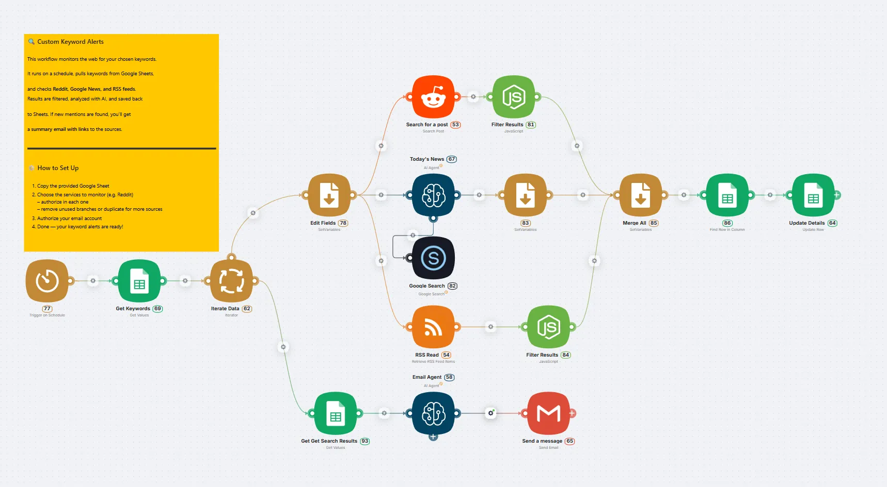

# AI Agent for Brand Mention Monitoring

## Solution Description

**AI Agent for Automatic Mention Monitoring** is a comprehensive brand reputation tracking system that operates 24/7 without human intervention. The agent autonomously searches for mentions of your keywords across Reddit, Google News, and RSS feeds, analyzes them using artificial intelligence, and sends structured reports via email.

Want to discuss creating an AI agent? 👉 [**Contact us**](https://landing.latenode.com#get-started)

## What the AI Agent Does

### Automatic Search and Monitoring

- **Scheduled operation**: launches at any time (hourly, daily, weekly)
- **Multi-channel search**: Reddit, Google News, RSS feeds from popular resources
- **Smart filtering**: excludes duplicates and outdated information (older than 24 hours)

### Intelligent Data Processing

- **AI content analysis**: OpenAI analyzes found mentions and determines their sentiment
- **Structured reporting**: automatic formatting into convenient HTML format
- **Contextual grouping**: mentions are sorted by relevance and importance

### Convenient Management and Notifications

- **Flexible keyword configuration** via Google Sheets
- **Smart notifications**: emails arrive only when new mentions are detected
- **Active links**: instant access to sources for quick response

> 💡 **Ready to automate your brand monitoring?** [Get started with our AI agent](https://landing.latenode.com#get-started) and never miss an important mention again.

## Target Use Cases

### 🏢 **Corporate Reputation**

**Task**: Tracking mentions of company, products, executives in media  
**Result**: Quick response to negative feedback, amplifying positive trends, controlling information field

### 🔍 **Competitive Intelligence**

**Task**: Monitoring competitor activities, their new products and strategies  
**Result**: Staying ahead of competitors, timely strategy adjustments, finding market opportunities

### 📊 **Marketing Analytics**

**Task**: Tracking industry trends, consumer sentiment, viral content  
**Result**: Data for marketing decisions, generating ideas for content strategy

### 🚨 **Crisis Management**

**Task**: Early detection of potential PR crises and negative trends  
**Result**: Minimizing reputation risks, quick response to problems

> 🚀 **Transform your reputation management today!** [Contact our team](https://landing.latenode.com#get-started) to set up your 24/7 monitoring system.

## Economic Impact

### Resource Savings

- **Replacing manual monitoring**: automating work that previously required 2-4 hours daily from an employee
- **Reducing costs on external services**: replacing expensive monitoring systems
- **Optimizing team working time**: freeing specialists for strategic tasks

### Efficiency Improvement

- **24/7 monitoring**: tracking mentions around the clock, including weekends
- **Instant notifications**: reaction to important events within hours, not days
- **Complete coverage**: simultaneous monitoring of dozens of keywords across multiple sources

## Technical Advantages on latenode.com

- **Ready platform for creating AI agents**: deploys quickly, can be modified without programming
- **Integration with popular services**: Google Sheets, Gmail, OpenAI, Yandex, Mail.ru, etc.
- **Scalability**: easily add new sources and keywords
- **Reliability**: runs on cloud infrastructure with high availability

## Initial Setup

1. **Prepare keyword list** in Google Sheets (brand, products, competitors, industry)
2. **Select monitoring sources** (Reddit, news sites, industry blogs)
3. **Configure schedule** and notification recipients
4. **Test run** and parameter adjustment

---

*This AI agent transforms the chaotic process of reputation monitoring into a structured system that works autonomously and delivers concrete business results from day one.*

Want to discuss creating an AI agent? 👉 [**Contact us**](https://landing.latenode.com#get-started)
