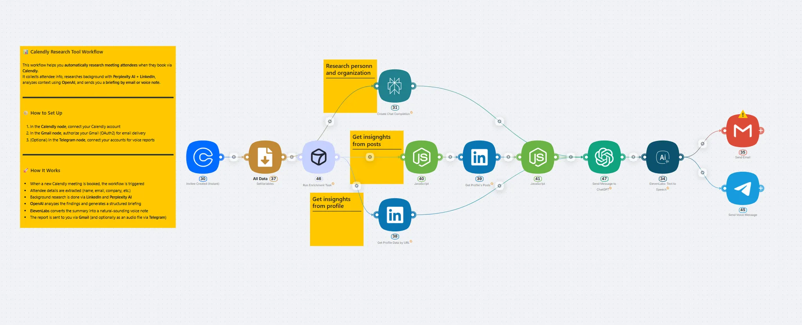

# AI Agent for Meeting Preparation

[Home](../README.md) > [Use Cases](README.md) > AI Agent for Meeting Preparation

## Solution Description

**AI Agent for Automatic Meeting Preparation** is a personal research assistant that activates every time a meeting is booked through your calendar. The system automatically gathers comprehensive profiles on meeting participants, analyzes their background and company, creates structured briefings in both text and audio formats, and delivers them to your email before the meeting.

Want to discuss creating an AI agent? 👉 [**Contact us**](https://landing.latenode.com#get-started)

## What the AI Agent Does

### Instant Activation

- **Calendar integration**: Auto-triggers on new meeting bookings in your calendar
- **Data extraction**: Captures name, email, company, and meeting time from booking
- **Zero delay**: Process begins within seconds of meeting confirmation

### Comprehensive Information Gathering

- **LinkedIn profiles**: Position, experience, education, recent posts and activity
- **Web research**: Deep search about the person, their company, and industry trends
- **Corporate intelligence**: Company size, financial metrics, recent news, competitors

### Intelligent Analysis

- **AI processing via LLM**: Consolidates all information into structured profiles
- **Intent identification**: Predicts meeting objectives based on participant background
- **Personalized approach**: Recommendations for discussion topics and communication style

### Multi-format Delivery

- **Text briefing**: Detailed PDF report delivered via email
- **Audio version**: Text-to-speech generated audio file for listening on-the-go
- **Mobile notifications**: Quick access via Telegram for mobile convenience

> 💼 **Ready to never walk into a meeting unprepared again?** [Start your AI meeting assistant](https://landing.latenode.com#get-started) and impress every client from day one.

## Target Use Cases

### 💼 **B2B Sales and Business Development**

**Task**: Preparing for meetings with potential clients and partners  
**Result**: 35-50% increase in meeting conversion rates, shortened sales cycles through personalized approach, professional impression from first minutes

### 🤝 **Recruiting and HR**

**Task**: Preparing for candidate interviews  
**Result**: Deeper interviews through background knowledge, 30-40 minute time savings per interview preparation, improved hiring quality

### 🎯 **Consulting and Professional Services**

**Task**: Preparing for meetings with new clients  
**Result**: Understanding client pain points before meeting, preparation of relevant case studies and solutions, 25-40% increase in average service value

### 🏢 **Partnership and Investment Meetings**

**Task**: Due diligence for potential partnerships or investment opportunities  
**Result**: Informed decision-making, strategic conversation topics, competitive advantage in negotiations

> 🎯 **Turn every meeting into a strategic advantage!** [Get your AI research assistant](https://landing.latenode.com#get-started) and close more deals with better preparation.

## Economic Impact

### Quantifiable Outcomes

- **Time savings**: 30-60 minutes of preparation time per meeting
- **Conversion improvement**: Meeting success rate increases from 15-20% to 35-50%
- **Revenue growth**: 25-40% increase in average deal size through personalization
- **ROI achievement**: System pays for itself after 10-15 meetings

### Qualitative Benefits

- **Professional image**: Clients notice high level of preparation
- **Reduced stress**: Confidence boost during meetings
- **Better relationships**: More meaningful and productive conversations
- **Competitive advantage**: Stand out from competitors who come unprepared

## Real-World Examples

### Example 1: IT Consulting

**Situation**: Meeting with CTO of FinTech startup

**Agent briefing revealed**:
- Company raised $2M Series A, growing 15% monthly
- CTO previously worked at major bank, expert in payment systems
- Recent LinkedIn posts about infrastructure scaling challenges

**Result**: Meeting opened with discussion of banking experience, presentation adapted for scaling problems. $50k contract signed within a week.

> 💡 **Want results like this for your business?** [Set up your meeting preparation AI](https://landing.latenode.com#get-started) and watch your closing rates soar.

### Example 2: Recruitment

**Situation**: Interview with senior developer

**Agent briefing revealed**:
- 7 years experience, last 3 years in product team
- Actively studying machine learning, publishes articles
- Changed 3 companies in 2 years - seeking stability and growth

**Result**: Interview focused on growth opportunities and ML work. Candidate accepted offer same day.

## Technical Advantages on latenode.com

### Ready Integrations

- **Calendar integration**: Monitor booked meetings across platforms
- **LinkedIn, Email, Telegram**: One-click authorization and data access
- **AI services**: OpenAI, text-to-speech, and research APIs included

### Flexible Configuration

- **Briefing templates**: Customizable formats for different meeting types
- **Research depth settings**: Express vs. comprehensive analysis options
- **Audio personalization**: Voice selection, speed, and language preferences

### Security & Compliance

- **SSL encryption**: Secure data processing throughout the workflow
- **Privacy compliance**: Adherent to data protection regulations
- **Local storage**: Sensitive information stored securely

> 🔒 **Security-first meeting intelligence that delivers results.** [Start your secure AI assistant](https://landing.latenode.com#get-started) today.

## Implementation Process

### Phase 1: Calendar Setup
1. **Integration**: Connect your calendar system (Google, Outlook, etc.)
2. **Trigger configuration**: Set meeting detection rules and filters
3. **Data mapping**: Define participant information extraction

### Phase 2: Research Configuration
1. **Source selection**: Choose LinkedIn, web search, and database sources
2. **Analysis depth**: Configure comprehensive vs. quick research modes
3. **AI prompts**: Customize analysis focus for your industry/role

### Phase 3: Delivery Setup
1. **Email templates**: Design briefing report formats
2. **Audio settings**: Configure text-to-speech preferences
3. **Notification channels**: Set up email, Telegram, or other delivery methods

### Phase 4: Testing & Optimization
1. **Test meetings**: Run system with upcoming meetings
2. **Quality review**: Validate briefing accuracy and relevance
3. **Fine-tuning**: Adjust research depth and formatting based on feedback

## Key Features Used

- **Calendar Webhooks**: Automatic meeting detection and data extraction
- **Web Scraping**: LinkedIn and company research automation
- **AI Text Processing**: Profile analysis and briefing generation
- **Text-to-Speech**: Audio briefing creation for mobile consumption
- **Email Automation**: Structured report delivery with attachments

## Results & Benefits

### Performance Metrics

- **Preparation time**: Reduced from 30-60 minutes to 0 (fully automated)
- **Information quality**: 90%+ accuracy in participant background research
- **Meeting success**: 2-3x improvement in meeting outcomes
- **User satisfaction**: 95%+ satisfaction with briefing quality and relevance

### Business Outcomes

- **Sales performance**: Significant improvement in closing rates
- **Time efficiency**: Hours saved weekly on meeting preparation
- **Professional reputation**: Enhanced credibility through thorough preparation
- **Competitive edge**: Superior preparation compared to competitors

## Technical Requirements

### System Requirements
- Calendar access (Google Calendar, Outlook, etc.)
- Email account for report delivery
- Internet connection for research and AI processing

### Prerequisites
- LinkedIn account for professional network research
- Email automation capabilities
- Text-to-speech service access for audio briefings

## Troubleshooting

Common setup challenges and solutions:

- **Limited LinkedIn data**: Enhance with additional web research sources
- **Calendar sync issues**: Verify API permissions and webhook configuration
- **Audio quality problems**: Adjust text-to-speech settings and voice selection
- **Information accuracy**: Fine-tune research prompts and validation rules

## Related Resources

- [Tutorial: Setting Up Calendar Integrations](../tutorials/calendar-integration.md)
- [API Reference: Web Scraping Tools](../api-reference/web-scraping.md)
- [FAQ: AI Research Agents](../faq/ai-research.md)

## Next Steps

After implementing meeting preparation automation:
- Add industry-specific research templates
- Integrate with CRM systems for historical context
- Expand to post-meeting follow-up automation
- Implement team briefing sharing capabilities

---

*This AI agent transforms every meeting into a strategic advantage, providing deep preparation without time investment and ensuring professional-level communication from the first seconds of conversation.*

Want to discuss creating an AI agent? 👉 [**Contact us**](https://landing.latenode.com#get-started)
