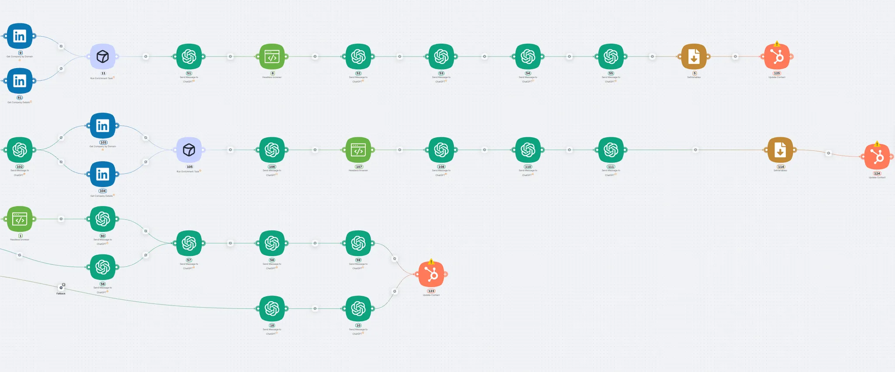

# AI Agent for Lead Qualification

[Home](../README.md) > [Use Cases](./README.md) > AI Agent for Lead Qualification

## Problem Statement

Lead qualification is a critical bottleneck in B2B sales that consumes significant resources while often producing inconsistent results:

- **Time-intensive research**: Manual lead research takes 15 minutes per lead, consuming 25 hours monthly for 100 leads
- **High labor costs**: SDR time costs approximately $2,000/hour, totaling $50,000 monthly for basic qualification
- **Inconsistent data quality**: Manual processes achieve only 60-70% accuracy
- **Slow response times**: Lead qualification takes 2-24 hours, causing lost opportunities
- **Limited scalability**: Human capacity constraints prevent processing large lead volumes
- **Missed opportunities**: Delayed qualification leads to competitor advantages

## Solution Overview

The **AI Agent for Lead Qualification** is an intelligent system that instantly enriches incoming leads with comprehensive business intelligence, scores them against your Ideal Customer Profile (ICP), and delivers actionable insights to sales teams within 2-3 seconds of registration.

### Key Features

- **Instant Lead Enrichment**: Automated data collection from 40+ sources
- **ICP Scoring**: Intelligent evaluation against ideal customer profiles
- **Real-time Processing**: Complete lead dossier ready in 2-3 seconds
- **Smart Alerts**: Notifications only for high-potential prospects
- **CRM Integration**: Seamless integration with existing sales systems

> 🚀 **Stop wasting time on unqualified leads!** [Get instant lead intelligence](https://landing.latenode.com#get-started) and focus on prospects that convert.

## How It Works

### 1. Instant Activation
- **Registration Trigger**: Automatically launches when new leads enter CRM
- **Multi-source Enrichment**: Gathers data from 40+ criteria including LinkedIn, company databases, and financial records
- **Rapid Processing**: Complete profile ready in 2-3 seconds

### 2. Intelligent Lead Scoring
- **ICP Scoring**: Automatic evaluation against ideal customer profile criteria
- **Pain Point Identification**: Determines needs based on company profile and contact role
- **Sales Segmentation**: Classifies leads by priority and suitable strategy

### 3. Personalized Insights
- **Personal Profile Analysis**: Position, experience, education, skills, social media activity
- **Corporate Analytics**: Company size, industry, revenue, technologies, competitors
- **Ready Conversation Starters**: Topics for discussion, mutual connections, relevant case studies

### 4. Automated Notifications
- **Smart Alerts**: Notifications only for high-score leads
- **Contextual Information**: Ready briefing for first call
- **CRM Integration**: All data saved in existing system

> 🎯 **Ready to 3x your conversion rates?** [Start qualifying leads with AI](https://landing.latenode.com#get-started) and watch your sales team close more deals.

## Target Use Cases

### 🚀 **SaaS and Technology Products**

**Challenge**: Rapid qualification of trial users and demo requests

**Results**:
- Trial to paid conversion increases by 45-60%
- First contact time reduced from hours to minutes
- Personalization from first interaction

**Case Study**: B2B SaaS platform automated qualification of 300+ leads monthly. High-score leads (20% of total flow) showed 67% conversion to paid customers vs. 12% for unenriched leads.

### 💼 **Consulting and Professional Services**

**Challenge**: Determining client budgets and needs at initial interest stage

**Results**:
- Average project value increased by 35%
- Deal closing time reduced by 40%
- Unqualified lead filtering by 70%

**Case Study**: IT consulting implemented system for enterprise client evaluation. Agent identified companies with $10M+ revenue, recent investments, and scaling problems, leading to 3x growth in large project conversions.

> 💰 **Want 3x growth in your conversions too?** [Implement AI lead qualification](https://landing.latenode.com#get-started) and transform your sales pipeline today.

### 🏢 **Enterprise B2B Sales**

**Challenge**: Prioritizing leads for expensive sales cycles

**Results**:
- Focus on high-potential leads
- Research time reduction by 85%
- Hit rate improvement by 50%

### 📊 **Marketing Agencies**

**Challenge**: Qualifying potential clients for retainer agreements

**Results**:
- Budget and company scale determination
- Current marketing problem identification
- Industry-specific pitch personalization

## Economic Impact

### Traditional Lead Qualification Process

**Manual SDR Work (100 leads/month)**:
- Research time: 15 minutes per lead × 100 = 25 hours
- Time cost: 25 hours × $2,000/hour = $50,000
- Data quality: 60-70% accuracy
- Response speed: 2-24 hours

### AI Agent Solution

**Automated Processing**:
- Processing time: 2-3 seconds per lead automatically
- Data quality: 90-95% accuracy
- Response speed: Instant

### Conversion Impact

**Before Implementation**:
- Lead to meeting conversion: 15%
- Meeting to deal conversion: 25%
- Overall conversion: 3.75%

**After Implementation**:
- Lead to meeting conversion: 28% (through personalization)
- Meeting to deal conversion: 40% (better qualification)
- Overall conversion: 11.2%

**Result**: 3x conversion growth with same marketing spend

> 📈 **Imagine tripling your conversions without spending more on marketing.** [Make it reality with our AI solution](https://landing.latenode.com#get-started).

## Competitive Advantages

### vs Manual SDR Qualification
- **Speed**: Seconds instead of hours
- **Data Completeness**: 40+ parameters vs basic information
- **Consistency**: Same quality for every lead
- **Scalability**: Unlimited lead capacity

### vs Existing Enrichment Services
- **Complexity**: Not just data, but ICP scoring
- **CRM Integration**: Direct work within existing processes
- **Customization**: Criteria adjustment for business specifics
- **Local Market**: Understanding of regional nuances

### vs Basic CRM Capabilities
- **Analysis Depth**: From surface data to business insights
- **Proactivity**: System finds information automatically
- **Intelligence**: AI analyzes and interprets data

## Real Results Case Study

### Latenode: +37% MRR Growth

**Initial Data**:
- 150 trial registrations monthly
- 12% trial to paid conversion
- Average ticket: $200/month

**Results After Implementation**:
- High-potential leads identified (ICP score 80+): 25% of flow
- High-score lead conversion: 48%
- Overall MRR growth: +37%
- System ROI: 850% in first 6 months

### Detailed Lead Analytics Example

**Lead Profile**:
- **ICP Score**: 88.5/100 (Strong Fit)
- **Position**: Product Owner
- **Company**: Latenode (25 employees, $1M-5M revenue)
- **Industry**: Information Technology & Services
- **Technical Leader**: Yes
- **Pain Points**: Challenges in scaling automation solutions

**Business Insights**:
- **Company Fit**: Industry aligns with IT services (+2 points)
- **Intent Signal**: Regularly shares insights on automation (+1 point)
- **Need Factor**: Focus on enhancing automation capabilities (+1 point)
- **Tech Factor**: Utilizes AI and low-code platforms

> 🔍 **Get this level of insight for every lead in your pipeline.** [Start your AI qualification system](https://landing.latenode.com#get-started) now.

## Technical Capabilities

### Ready CRM Integrations
- **HubSpot**: Complete field and status synchronization
- **Salesforce**: Custom objects and automation
- **Intercom**: Chat and ticket enrichment
- **HighLevel**: Sales funnel integration
- **AmoCRM**: Russian company processing
- **Any API**: Universal connectors

### Data Sources
- **LinkedIn**: Professional information and activity
- **Clearbit**: Corporate data and technology stack
- **Hunter.io**: Contact information and email verification
- **BuiltWith**: Website technologies and tools
- **Crunchbase**: Funding and investments
- **Google**: Public information and news

### Smart Configuration
- **Custom ICP Models**: Business-specific adaptation
- **Industry Templates**: Ready settings for different niches
- **A/B Testing**: Scoring criteria optimization
- **Dynamic Thresholds**: Automatic adjustment based on results

## Cost Comparison

### Alternative Solutions
- **Manual SDR Research**: $500-1,000 per lead
- **Clearbit/ZoomInfo**: $150-300/month + $2-5 per lead
- **Additional SDR Hire**: $150,000/month + benefits

### ROI Timeline
- **First Additional Deal**: Pays for system for 6-12 months
- **20% Conversion Growth**: Pays back in 2-4 weeks
- **Long-term ROI**: 500-1,500% annually

## Implementation Process

### Phase 1: Setup (Week 1)
1. **CRM Integration**: Connect existing sales system
2. **ICP Definition**: Configure ideal customer profile criteria
3. **Data Source Setup**: Establish enrichment connections
4. **Scoring Model**: Customize evaluation parameters

### Phase 2: Testing (Week 2)
1. **Sample Processing**: Test with historical leads
2. **Score Calibration**: Adjust thresholds based on results
3. **Team Training**: Brief sales team on new insights
4. **Workflow Integration**: Embed into existing processes

### Phase 3: Optimization (Ongoing)
1. **Performance Monitoring**: Track conversion improvements
2. **Model Refinement**: Continuously improve scoring accuracy
3. **Process Enhancement**: Optimize based on team feedback
4. **Scale Expansion**: Increase lead processing volume

## Success Metrics

### Efficiency Gains
- **Processing Speed**: From hours to seconds (99.9% time reduction)
- **Data Accuracy**: From 60-70% to 90-95%
- **Team Productivity**: 85% reduction in research time
- **Lead Response**: Instant vs 2-24 hour delays

### Revenue Impact
- **Conversion Rate**: 3x improvement typical
- **Deal Size**: 35% average increase
- **Sales Cycle**: 40% reduction in closing time
- **ROI**: 850%+ in first 6 months

## Getting Started

Ready to transform your lead qualification process? The AI Lead Qualification Agent can be implemented within your existing workflow in just 2 weeks, delivering immediate improvements in lead quality and sales team efficiency.

### Prerequisites
- Active CRM system (HubSpot, Salesforce, or API-compatible)
- Lead generation process in place
- Sales team ready for enhanced lead intelligence
- Basic ICP definition

### Next Steps
1. **Assessment**: Evaluate current lead qualification process
2. **Integration Planning**: Map CRM and data source connections
3. **ICP Workshop**: Define ideal customer profile criteria
4. **Implementation**: Deploy and configure AI agent
5. **Training**: Onboard sales team with new capabilities

---

*Transform every website registration into a qualified sales opportunity, providing your team with all necessary information for personalized and effective prospect engagement from the first seconds of contact.*

## Related Use Cases

- [AI Sales Agent (AI SDR)](./ai-sales-agent.md) - Autonomous outbound sales automation
- [AI Agent for Brand Monitoring](./ai-agent-brand-monitoring.md) - Automated reputation tracking
- [AI Agent for Social Media Marketing](./ai-smm-agent.md) - Automated content generation

## Learn More

Interested in implementing an AI Lead Qualification Agent for your business? [Contact us](https://landing.latenode.com#get-started) to discuss your specific requirements and see how this solution can transform your sales process.
