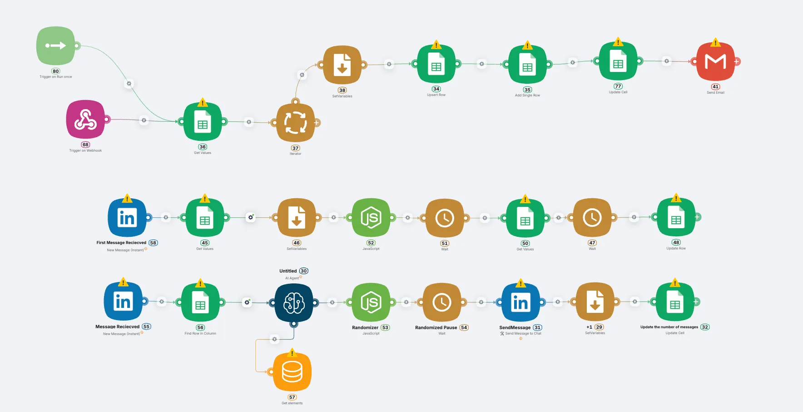

# AI Sales Agent (AI SDR)

[Home](../README.md) > [Use Cases](./README.md) > AI Sales Agent (AI SDR)

## Problem Statement

Outbound sales teams face significant challenges that limit growth and profitability:

- **High employee turnover**: 40-60% annual turnover rate among SDR teams
- **Lengthy training periods**: 3-6 months before SDRs reach effectiveness
- **Emotional burnout**: Constant rejection leads to decreased performance
- **Inconsistent quality**: Varying performance levels across different SDRs
- **Escalating costs**: Salaries, benefits, training, and equipment expenses
- **Limited scalability**: Human capacity constraints prevent rapid expansion

## Solution Overview

The **AI Sales Agent (AI SDR)** is an autonomous outbound sales automation system that completely replaces traditional SDR teams. The agent independently finds leads, enriches data from LinkedIn, creates personalized messages based on prospect activity, and conducts multi-channel communication (LinkedIn + Email) until generating qualified leads for the sales team.

Key automation components:
- **Automated lead generation** from multiple data sources
- **Intelligent data enrichment** using LinkedIn activity analysis
- **Personalized messaging** based on real prospect interests
- **Omnichannel outreach** combining LinkedIn and email strategies
- **Full CRM integration** with complete interaction tracking

> 🚀 **Ready to replace your entire SDR team with AI?** [Get your autonomous sales agent](https://landing.latenode.com#get-started) and scale without limits.

## Key Features Used

- **Lead Sources Integration**: Apollo, ZoomInfo, Apify, Hunter, CSV imports
- **LinkedIn Analysis**: Profile activity, posts, career updates, and connections
- **OpenAI GPT-4**: Personalized message generation and A/B testing
- **Multi-channel Automation**: LinkedIn personal accounts and Sales Navigator
- **Email Integration**: Gmail, Outlook, Yandex, any SMTP providers
- **CRM Systems**: HubSpot, Salesforce, Pipedrive, AmoCRM integration

## Implementation Details

### Setup Process

1. **Lead Source Configuration**: Connect Apollo, ZoomInfo, or upload CSV databases
2. **LinkedIn Account Setup**: Configure personal accounts and Sales Navigator integration
3. **Email Provider Integration**: Connect Gmail, Outlook, or custom SMTP servers
4. **CRM Integration**: Link with existing CRM for lead tracking and management
5. **Message Templates**: Create personalized templates for different segments
6. **A/B Testing Setup**: Configure message variants for optimization

### Configuration

Key settings and parameters:
- **Daily contact limits**: 45-200 contacts per day (respecting platform limits)
- **Response rate targets**: 3-6% conversion to demo meetings
- **Personalization depth**: LinkedIn activity analysis, career history, interests
- **Multi-channel timing**: Optimal intervals between LinkedIn and email outreach
- **Segment targeting**: Industry, role, company size, geographic filters

### Integration Requirements

- **Lead databases**: Apollo, ZoomInfo, or custom CSV files
- **LinkedIn accounts**: Personal profiles or Sales Navigator access
- **Email providers**: Professional email accounts with sending permissions
- **CRM system**: Integration with existing sales pipeline management
- **Latenode Platform**: Professional plan for advanced automation workflows

> 💼 **Stop losing deals to competitors with better outreach.** [Launch your AI SDR system](https://landing.latenode.com#get-started) and dominate your market.

## Results & Benefits

### Quantifiable Outcomes

- **Cost savings**: $180,000-300,000/year vs traditional SDR team
- **Volume increase**: 200-500 contacts per day vs 45-60 from human SDRs
- **Demo meetings**: 180-450 per month vs 25-40 from traditional teams
- **Conversion rates**: 3-6% to demos (higher due to personalization)
- **24/7 operation**: Works across all time zones without breaks

### Business Impact

- **Instant scalability**: No hiring delays or training periods
- **Consistent quality**: Uniform performance across all interactions
- **Full transparency**: Complete tracking and analytics of every step
- **Risk mitigation**: No employee turnover or burnout issues
- **Global reach**: Simultaneous operation in multiple markets

> 🎆 **Transform your sales from chaos to predictable revenue.** [Start your AI sales transformation](https://landing.latenode.com#get-started) today.

## Economic Impact

### Resource Savings

**Traditional 3-person SDR team monthly costs**:
- **Salaries**: $15,000 (3 × $5,000)
- **Benefits & taxes**: $4,500 (30% of salaries)
- **Tools** (CRM, Apollo, LinkedIn Sales Navigator): $1,500
- **Training & onboarding**: $2,000
- **Total**: $23,000/month ($276,000/year)

**AI Sales Agent solution**:
- **Platform cost**: Starting from $2,000/month
- **Unlimited volume**: No capacity constraints
- **Instant deployment**: No training or onboarding required
- **ROI**: 300-600% in first quarter

### Efficiency Improvements

- **Scale without limits**: Hundreds of agents working simultaneously
- **Intelligent targeting**: Multi-segment testing and optimization
- **Real-time adaptation**: Instant strategy adjustments based on responses
- **Anti-spam protection**: Automatic compliance with platform limits
- **Backup systems**: Seamless account switching during restrictions

## Target Use Cases

### 🚀 B2B SaaS Startups

**Challenge**: Rapid sales scaling without building large SDR teams

**Results achieved**:
- Save $180,000-300,000/year on SDR salaries
- Increase demo meetings 3-5x
- Test 10+ segments simultaneously

**Case study**: Fintech startup replaced 4-person SDR team with AI agents. In 3 months, qualified leads increased from 45 to 180 per month while reducing costs by 70%.

> 💰 **Save $300K/year while 4x your lead generation.** [See how our AI can do this for you](https://landing.latenode.com#get-started).

### 💼 Consulting Agencies

**Challenge**: Constant new client flow without distracting experts from delivery

**Results achieved**:
- Automated cold outreach for partners and directors
- Industry-specific personalization based on client expertise
- Focus human resources on closing deals

**Case study**: IT consulting launched 5 agents across different verticals. Each agent generates 25-30 qualified meetings monthly, with 40% increase in average deal size.

### 🏢 Enterprise Products

**Challenge**: Penetrating large corporations through personalized approach

**Results achieved**:
- Research target companies and contacts
- Multi-point influence building (multiple contacts per company)
- Long-term nurturing of complex deals

### 🌍 International Expansion

**Challenge**: Entering new markets without local sales teams

**Results achieved**:
- Operation across any time zones
- Message adaptation to local culture
- Product-market fit testing in new regions

## Technical Requirements

### System Requirements

- **Latenode Platform**: Professional plan for complex automation workflows
- **Lead databases**: Apollo, ZoomInfo, or CSV import capabilities
- **LinkedIn accounts**: Multiple personal accounts or Sales Navigator
- **Email infrastructure**: Professional email accounts with good deliverability
- **CRM integration**: API access to existing sales management system

### Prerequisites

- **Lead data access**: Subscription to lead generation platforms
- **LinkedIn compliance**: Understanding of platform limits and best practices
- **Email reputation**: Clean sending domains and authentication setup
- **CRM permissions**: Admin access for integration configuration

## Initial Setup

1. **Data Source Preparation**: Set up lead databases and import existing contacts
2. **Account Configuration**: Connect LinkedIn profiles and email accounts
3. **Message Development**: Create industry-specific templates and personalization rules
4. **Testing Phase**: Run small-scale tests to optimize conversion rates
5. **Full Deployment**: Scale to target volume with monitoring and optimization

## Performance Metrics

### Real A/B Testing Results (1 Week)

**Multi-segment performance**:
- **Segment 1** (Startup CTOs): 4.2% conversion
- **Segment 2** (Head of Sales): 6.8% conversion ⭐ (best performing)
- **Segment 3** (Founders): 2.1% conversion  
- **Segment 4** (VP of Marketing): 5.3% conversion
- **Segment 5** (Operations Directors): 1.8% conversion

**Channel comparison**:
- **LinkedIn connection requests**: 15% acceptance rate
- **LinkedIn messages** (after connection): 18% reply rate
- **Cold email follow-up**: 8% reply rate
- **Combined approach**: 24% overall response rate

> 📈 **Get 24% response rates with AI-powered personalization.** [Build your sales machine](https://landing.latenode.com#get-started) and watch your pipeline explode.

## Competitive Advantages

### Vs Traditional SDRs
- **Scalability**: Instant volume increases without hiring
- **Consistency**: Uniform high quality performance always
- **Analytics**: Complete transparency of every interaction
- **Availability**: 24/7 operation across time zones

### Vs Sales Automation Tools
- **Deep personalization**: LinkedIn activity analysis
- **Omnichannel approach**: LinkedIn + Email in unified workflow
- **Intelligent adaptation**: Strategy changes based on responses
- **Anti-spam protection**: Automatic compliance with platform limits

### Vs Outsourced SDR Agencies
- **Full control**: All processes remain internal
- **Data security**: Your data stays with your company
- **Instant adjustments**: Real-time strategy modifications
- **Long-term reliability**: No dependency on external teams

## Risk Management

### Potential Risks & Mitigation

- **LinkedIn account restrictions**: Solved through multi-account distribution and limit compliance
- **Lead quality decline**: Addressed with continuous A/B testing and filter adjustments
- **Platform algorithm changes**: Mitigated by system flexibility and rapid updates
- **Deliverability issues**: Managed through email reputation monitoring and rotation

## Troubleshooting

Common issues and solutions:

- **Low response rates**: Adjust personalization depth, test different messaging angles
- **Account restrictions**: Implement stricter daily limits, use account rotation
- **Poor lead quality**: Refine targeting criteria, improve data source filters
- **CRM sync issues**: Check API permissions, verify field mapping configuration

## Related Resources

- [Tutorial: LinkedIn API Integration Setup](../docs/tutorials/linkedin-api-setup.md)
- [Tutorial: Multi-channel Sales Sequences](../docs/tutorials/sales-sequences.md)
- [FAQ: Sales Automation Compliance](../docs/faq/sales-automation.md)

## Next Steps

Suggested actions after implementing this use case:
- Expand to additional channels (Twitter, Facebook outreach)
- Implement advanced lead scoring and qualification
- Add sales call scheduling automation
- Develop predictive analytics for lead prioritization
- Create automated follow-up sequences for different response types

---

*This AI agent transforms chaotic lead management into a predictable revenue generation machine, operating with the efficiency of top SDR managers but without their limitations and overhead costs. Ready to automate your sales outreach? Contact us at [latenode.com](https://landing.latenode.com#get-started).*
