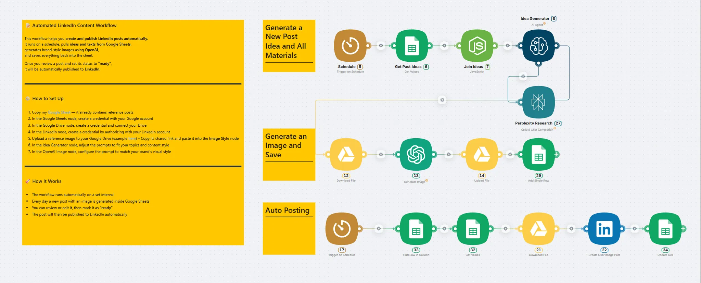

# AI Agent for Social Media Marketing (SMM)

[Home](../README.md) > [Use Cases](./README.md) > AI Agent for Social Media Marketing

## Problem Statement

Social media marketing requires consistent, high-quality content creation that demands significant time and resources from businesses. Key challenges include:

- **Time-intensive content creation**: Manual post writing, image creation, and scheduling takes 15-20 hours per week
- **Inconsistent posting**: Irregular content publication affects audience engagement and algorithm performance  
- **High costs**: SMM specialists cost $3,000-6,000/month, agencies charge $5,000-15,000/month for 20-30 posts
- **Limited scalability**: Human capacity constraints prevent scaling content volume
- **Trend monitoring**: Difficulty staying current with industry trends and viral content formats

## Solution Overview

The **AI Viral Content Generator for SMM** is an automated 24/7 system that creates and publishes professional social media content. The system generates unique post ideas, creates branded visuals, stores everything in Google Sheets for moderation, and automatically publishes approved content to social networks on schedule.

Key automation components:
- **Trend research** via Perplexity AI to identify viral topics
- **Content generation** using OpenAI for brand-aligned copywriting
- **Visual creation** with DALL-E for branded images
- **Quality control** through centralized moderation system
- **Smart scheduling** based on audience activity analysis

> 🚀 **Stop spending 20 hours/week on social media content.** [Automate your entire SMM strategy](https://landing.latenode.com#get-started) and focus on growing your business.

## Key Features Used

- **Perplexity Research**: Analyzes trends and hot topics in your industry niche
- **OpenAI GPT-4**: Generates high-quality text content adapted to brand voice
- **DALL-E 3**: Creates unique branded images and visual content
- **Google Workspace**: Sheets for content management, Drive for asset storage
- **LinkedIn API**: Direct publishing of posts and images
- **Smart Scheduling**: Optimal timing based on audience engagement patterns

## Implementation Details

### Setup Process

1. **Content Strategy Configuration**: Define brand voice, industry focus, and content pillars
2. **Visual Brand Guidelines**: Upload logos, color schemes, and style preferences for image generation
3. **Moderation Workflow**: Set up Google Sheets with approval stages (draft → ready → published → archived)
4. **Publishing Schedule**: Configure posting frequency and optimal timing based on audience analysis
5. **Integration Setup**: Connect LinkedIn API, OpenAI, and Google Workspace accounts

### Configuration

Key settings and parameters:
- **Posting frequency**: Daily, weekly, or custom intervals
- **Content tone**: Professional, casual, thought leadership, or industry-specific
- **Image style**: Corporate, modern, minimalist, or brand-specific templates
- **Approval workflow**: Single approver or multi-stage review process
- **Analytics tracking**: Engagement metrics, click-through rates, and lead generation

### Integration Requirements

- **LinkedIn Business Account**: For API access and publishing permissions
- **OpenAI API**: GPT-4 and DALL-E 3 access for content generation
- **Google Workspace**: Sheets and Drive for content management
- **Perplexity API**: For trend research and topic discovery
- **Latenode Platform**: For workflow orchestration and automation

> 🎯 **Ready to become a thought leader in your industry?** [Launch your AI content machine](https://landing.latenode.com#get-started) and build authority while you sleep.

## Results & Benefits

### Quantifiable Outcomes

- **Time saved**: 15-20 hours per week on content creation
- **Cost reduction**: $80,000-150,000/year vs hiring SMM specialist
- **Content volume**: Unlimited posts vs 20-30 posts from agencies
- **Engagement growth**: 40-60% increase in first month
- **Lead generation**: 300-500% increase in incoming inquiries

### Business Impact

- **24/7 operation**: Continuous content generation and optimal posting times
- **Consistent brand presence**: Regular, high-quality posts maintain audience engagement
- **Scalable growth**: Handle multiple social accounts without additional resources
- **Expert positioning**: Thought leadership content builds industry authority
- **ROI improvement**: 400-800% return on investment within 6 months

> 📈 **Get 400-800% ROI from automated social media.** [Start your content automation](https://landing.latenode.com#get-started) and watch your leads multiply.

## Economic Impact

### Resource Savings

- **SMM specialist replacement**: Save $80,000-150,000/year on salary and benefits
- **Agency costs elimination**: Save $100,000-300,000/year vs external agencies  
- **Executive time**: Free up 10-15 hours per week for strategic work
- **Design costs**: Eliminate $2,000-5,000 per image from external designers
- **Copywriting expenses**: Replace $3,000-8,000 per post freelance costs

### Efficiency Improvements

- **Instant content generation**: No waiting queues or revision cycles
- **Trend adaptation**: Real-time adjustment to viral topics and industry news
- **Multi-platform scaling**: Manage multiple social accounts simultaneously
- **Analytics-driven optimization**: Data-based strategy refinement
- **Quality consistency**: Maintain brand standards across all content

## Target Use Cases

### 🚀 Personal Branding for Executives

**Challenge**: Building expert reputation on LinkedIn without time investment

**Results achieved**:
- Follower growth: 150-300% increase in 3 months
- Incoming leads: 200-400% increase in business inquiries
- Industry positioning: Recognition as thought leader

**Case study**: IT company CEO automated 6-month content plan. Profile grew from 500 to 2,300 followers in 4 months, with 5x increase in incoming leads.

> 🚀 **Want to 5x your incoming leads like this CEO?** [Get your automated content system](https://landing.latenode.com#get-started) and become the go-to expert in your field.

### 💼 B2B Marketing for Companies

**Challenge**: Consistent presence in target audience feeds

**Results achieved**:
- Content consistency: 5-7 high-quality posts per week
- Organic traffic: 180% increase to company website
- Lead generation: 15-25 qualified leads per month

**Case study**: Consulting agency automated case studies and insights publication. Posts received 10x more engagement over 6 months, resulting in 8 new major clients.

### 🎯 Agencies and Freelancers

**Challenge**: Demonstrating expertise while attracting new clients

**Results achieved**:
- Time savings: 15-20 hours per week on content creation
- Project value: 30-50% increase in average project size
- Sales funnel: Content-driven lead generation system

**Case study**: Digital agency implemented system for 5 experts. Combined audience grew from 2,000 to 15,000 followers, leading to 40% revenue increase.

## Technical Requirements

### System Requirements

- **Latenode Platform**: Professional plan for advanced automation workflows
- **API Access**: OpenAI, LinkedIn, Google Workspace, and Perplexity subscriptions
- **Storage**: Google Drive for content assets and backup
- **Monitoring**: Analytics dashboard for performance tracking

### Prerequisites

- **LinkedIn Business Account**: Admin access for API integration
- **Brand Guidelines**: Logo files, color schemes, and tone of voice documentation
- **Content Strategy**: Industry focus, target audience definition, and content pillars
- **Approval Process**: Designated moderators and review workflow

## Initial Setup

1. **Preparation**: Gather brand assets, define content strategy, and set up required API accounts
2. **Configuration**: Import brand guidelines, configure content templates, and set posting schedules
3. **Testing**: Run pilot content generation and review approval workflow
4. **Go Live**: Deploy automated system with monitoring and optimization

## Competitive Advantages

### Vs Manual Social Media Management
- **24/7 operation** vs limited working hours
- **Consistency** vs irregular posting schedules  
- **Scalability** vs limited human capacity
- **Data-driven approach** vs intuitive content creation

### Vs Standard Schedulers (Hootsuite, Buffer)
- **AI content generation** vs just scheduling existing content
- **Trend adaptation** vs static templates
- **Branded visuals** vs stock images
- **Moderation system** vs basic scheduling

### Vs Content Agencies
- **Instant adaptation** vs lengthy revision cycles
- **Unlimited volume** vs package limitations
- **Business knowledge** vs surface-level industry understanding
- **Full control** vs dependency on external teams

## Pricing Comparison

### Traditional Solutions
- **Content manager**: $100,000-200,000/year plus benefits
- **Marketing agency**: $150,000-500,000/year for 20-30 posts
- **Freelance copywriter**: $3,000-8,000 per post
- **Designer**: $2,000-5,000 per image

### Latenode Solution
- **Cost**: Starting from $1,000/month
- **Unlimited content** of any volume
- **Instant generation** without queues
- **Full cycle**: From idea to publication
- **ROI**: 300-600% in first quarter

## Guaranteed Results

### After 1 Month
- 20-30 quality posts in portfolio
- Configured auto-publishing system
- 40-60% engagement growth

### After 3 Months  
- Double LinkedIn follower count
- Steady stream of incoming inquiries
- Recognition as industry expert

### After 6 Months
- Top 5% activity in your industry
- Conference and interview invitations
- Measurable revenue growth from LinkedIn leads

> 🏆 **Join the top 5% of your industry with AI-powered content.** [Start your transformation](https://landing.latenode.com#get-started) and become the authority everyone follows.

## Troubleshooting

Common issues and solutions:

- **Low engagement rates**: Adjust posting times, refine content tone, or modify visual style
- **Content repetition**: Expand topic database, increase trend monitoring frequency
- **Brand inconsistency**: Review and update brand guidelines, retrain AI models
- **Publishing failures**: Check API credentials, verify account permissions

## Related Resources

- [Tutorial: Setting Up LinkedIn API Integration](../docs/tutorials/linkedin-api-setup.md)
- [Tutorial: Brand Voice Training for AI](../docs/tutorials/brand-voice-training.md)
- [FAQ: Social Media Automation](../docs/faq/social-media-automation.md)

## Next Steps

Suggested actions after implementing this use case:
- Expand to additional social platforms (Twitter, Instagram, Facebook)
- Implement cross-platform content adaptation
- Add competitor analysis and benchmarking
- Integrate CRM for lead tracking and nurturing
- Develop advanced analytics and reporting

---

*This AI agent transforms LinkedIn into an automatic lead generation and authority-building machine, working like a personal content department that never sleeps and always knows what to discuss. Ready to automate your social media? Contact us at [latenode.com](https://landing.latenode.com#get-started).*
