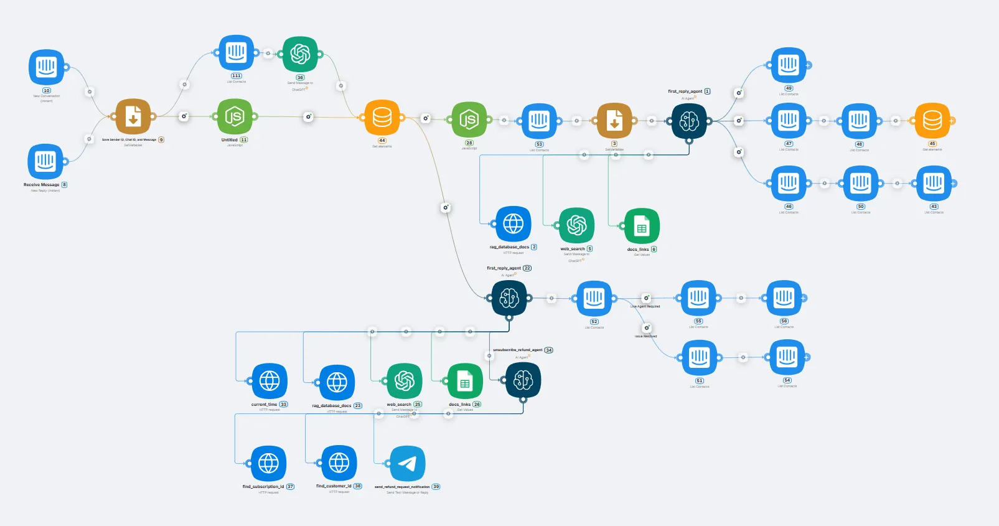

# AI Technical Support Agent 24/7

[Home](../README.md) > [Use Cases](./README.md) > AI Technical Support Agent 24/7

## Problem Statement

Customer support is a critical business function that faces significant operational challenges and cost pressures:

- **High operational costs**: Support teams of 20+ agents cost $2,000,000+ monthly in salaries and benefits
- **Limited availability**: Traditional support operates only during business hours, leaving customers waiting
- **Inconsistent quality**: Human agents provide varying response quality and knowledge depth
- **Slow response times**: First response typically takes 2-8 hours, causing customer frustration
- **High escalation rates**: 60-80% of tickets require escalation to senior support specialists
- **Scalability constraints**: Human capacity limits prevent handling traffic spikes or business growth

## Solution Overview

The **AI Technical Support Agent 24/7** is an autonomous customer service system that operates around the clock, processes requests in 15 seconds, and reduces support operational costs by 10x. The system integrates with online chat and CRM, analyzes context of each inquiry, provides personalized responses based on company knowledge base, and escalates complex cases to human agents only when necessary.

### Key Features

- **24/7 Availability**: Continuous operation without breaks or time zone limitations
- **15-Second Response Time**: Instant analysis and response to customer inquiries
- **Intelligent Triage**: Automatic classification of simple questions, complex cases, and spam
- **Context Awareness**: Maintains conversation history and customer interaction patterns
- **Smart Escalation**: Routes complex issues to appropriate human specialists

> 🚀 **Cut your support costs by 90% while improving customer satisfaction.** [Deploy your AI support agent](https://landing.latenode.com#get-started) and transform your customer service today.

## How It Works

### 1. Instant Request Analysis
- **Contextual Understanding**: Identifies user type, interaction history, and intent
- **Request Classification**: Automatically separates simple questions, complex cases, and spam
- **Rapid Response**: Provides answers within 15 seconds of request submission

### 2. Two-Tier Processing System

**For New Users**:
- Automatic greeting and spam detection
- Instant answers to standard questions
- Vector knowledge base search for complex requests
- Google Sheets integration for current links
- Automatic spam marking and internal reporting

**For Returning Customers**:
- Memory of last 50 messages for conversation context
- Natural continuation of previous conversations
- Skip spam verification (user already verified)
- Intelligent escalation to human or case closure

### 3. Smart Knowledge Base
- **Vector Search**: Semantic matching of questions with relevant answers from corporate knowledge base
- **Documentation Integration**: Direct connection to internal knowledge repositories
- **Dynamic Links**: Automatic updating of current materials and resources
- **Contextual Responses**: Adaptation to product specifics and user requirements

> 🎯 **Never leave a customer question unanswered again.** [Get your 24/7 AI support team](https://landing.latenode.com#get-started) and provide instant, accurate help around the clock.

## Target Use Cases

### 💼 **B2B SaaS Products**

**Challenge**: Processing technical questions, billing issues, onboarding new users

**Results**:
- 75-80% reduction in support team workload
- CSAT improvement from 3.2 to 4.6/5
- First response time reduced from 4 hours to 15 seconds

**Case Study**: CRM system processes 4,000+ inquiries monthly. AI agent resolves 80% autonomously, routes high-priority cases to humans with full context, allowing support team reduction from 40 to 8 FTE.

> 💰 **Reduce your support team from 40 to 8 people while improving service quality.** [See how AI can transform your support](https://landing.latenode.com#get-started).

### 🏢 **E-commerce and Retail**

**Challenge**: Questions about orders, returns, delivery, products

**Results**:
- 24/7 support without additional shifts
- Automatic processing of 90% standard requests
- Real-time order system integration for status updates

### 🎯 **EdTech and Online Services**

**Challenge**: Student assistance, platform technical support, billing

**Results**:
- Multi-timezone support coverage
- Instant responses to course and functionality questions
- Reduced churn rate through rapid problem resolution

### 🚀 **FinTech and Banking**

**Challenge**: Transaction questions, security issues, app functionality

**Results**:
- Compliance with response time requirements
- Automatic routing of sensitive questions
- Reduced call center volume

## Economic Impact

### Cost Comparison: Intercom Fin vs AI Agent

| Metric | Intercom Fin | AI Agent | Savings |
|--------|--------------|----------|---------|
| **Monthly Requests** | 10,000 | 10,000 | - |
| **Monthly Cost** | $10,000 | $1,000 | **90%** |
| **Cost per Request** | $1.00 | $0.10 | **90%** |
| **Spam Filtering** | Manual | Automatic | +100% efficiency |
| **Vendor Lock-In** | Yes | No | Full control |

### Traditional vs AI Support (5,000 requests/month)

**Traditional Support**:
- 20 support managers: $2,000,000/month
- Tools (Intercom, Zendesk): $250,000/month
- **Total**: $2,250,000/month

**AI Agent + 0.5 Senior Support**:
- AI agent: $50,000/month
- 0.5 FTE senior support: $75,000/month
- **Total**: $125,000/month

**Annual Savings**: $25,500,000 ($2,125,000 monthly savings)

> 📈 **Save over $25M annually while delighting customers.** [Calculate your savings with AI support](https://landing.latenode.com#get-started).

### Quality Improvements

**Before Implementation**:
- First Response Time: 2-8 hours
- Resolution Time: 24-48 hours
- CSAT Score: 3.2-3.8/5
- Escalation Rate: 60-80% to senior support
- Support Cost per Ticket: $8-15

**After AI Implementation**:
- First Response Time: 15 seconds
- Resolution Time: 2-3 minutes (automatic) / 30 minutes (with escalation)
- CSAT Score: 4.4-4.8/5
- Escalation Rate: 15-25% to human support
- Support Cost per Ticket: $0.50-1.50

## Competitive Advantages

### vs Ready-Made AI Solutions (Intercom Fin, Zendesk Answer Bot)
- **Cost**: 5-20x cheaper
- **Customization**: Full control over logic
- **Conversation Memory**: Maintains dialog context
- **Integration**: Works with any systems, not just partner platforms

### vs Custom Development
- **Implementation Time**: Days vs months of development
- **Development Cost**: Saves $50,000-500,000
- **Support & Updates**: Included in service
- **Ready Integrations**: 400+ connectors available

### vs Hiring Additional Support Agents
- **Stability**: Never quits or gets sick
- **Speed**: Instant responses vs minutes of waiting
- **Accuracy**: Access to entire knowledge base simultaneously
- **Cost**: 10-15x cheaper than FTE

## Technical Capabilities

### Popular System Integrations
- **Support Platforms**: Intercom, Zendesk, Freshdesk, ServiceNow, any others
- **CRM Systems**: HubSpot, Salesforce, Pipedrive, AmoCRM, Bitrix24, custom CRMs
- **Messengers**: Telegram, WhatsApp, Facebook Messenger, Slack
- **Knowledge Bases**: Notion, Confluence, GitBook, any internal wikis

### Smart Features
- **Vector Knowledge Base**: Semantic search through documentation
- **Contextual Memory**: Maintains conversation history and user preferences
- **Spam Detection**: ML algorithms for filtering irrelevant requests
- **Sentiment Analysis**: Determines customer emotional state
- **Multi-language Support**: Works in Russian, English, and other languages

> 🌍 **Provide world-class support in any language, 24/7.** [Launch your multilingual AI agent](https://landing.latenode.com#get-started) and serve customers globally.

### Transparency and Control
- **Visual Editor**: Configure logic through drag & drop interface
- **Audit Trail**: Complete history of all interactions
- **99.9% Uptime**: Cloud infrastructure with redundancy
- **Fallback Mechanisms**: Automatic switch to human on failures
- **Continuous Monitoring**: Real-time response quality tracking

## Additional Benefits

### Operational Excellence
- **Agent Productivity**: Frees 70-80% of time for complex cases
- **Customer Satisfaction**: Instant responses increase loyalty
- **Team Morale**: Staff focus on interesting challenges
- **Business Growth**: Support doesn't constrain scaling

### Risk Mitigation

**Potential Risks**:
- **Inaccurate AI responses**: Solved through regular knowledge base updates and A/B testing
- **Complex edge cases**: System automatically escalates non-standard situations
- **External API changes**: Quick updates thanks to flexible architecture

**Quality Guarantees**:
- **99.9% uptime**: Cloud infrastructure with backup systems
- **Fallback mechanisms**: Automatic human handoff on failures
- **Continuous monitoring**: Real-time response quality tracking

## Implementation Process

### Phase 1: Setup (Week 1)
1. **Platform Integration**: Connect existing support systems and CRM
2. **Knowledge Base Import**: Upload documentation and FAQ content
3. **Vector Database Setup**: Process and index knowledge for semantic search
4. **Basic Configuration**: Set up greeting messages and escalation rules

### Phase 2: Training (Week 2)
1. **Historical Data Processing**: Train on past support conversations
2. **Spam Filter Calibration**: Configure detection algorithms
3. **Response Quality Testing**: Validate answers against known good responses
4. **Escalation Logic Refinement**: Optimize human handoff triggers

### Phase 3: Optimization (Ongoing)
1. **Performance Monitoring**: Track resolution rates and customer satisfaction
2. **Knowledge Base Updates**: Continuously improve response accuracy
3. **Workflow Enhancement**: Optimize based on team feedback and metrics
4. **Scale Expansion**: Increase capacity and add new integration channels

## Success Metrics

### Efficiency Gains
- **Response Speed**: From hours to 15 seconds (99.9% improvement)
- **Resolution Rate**: 80% autonomous resolution
- **Cost Reduction**: 90% lower than traditional support
- **Availability**: 24/7 vs business hours only

### Quality Improvements
- **CSAT Score**: 4.4-4.8/5 vs 3.2-3.8/5
- **Consistency**: Uniform high quality always
- **Scalability**: Handle unlimited request volume
- **Team Focus**: Human agents work on complex, high-value cases

## Getting Started

Ready to transform your customer support operations? The AI Technical Support Agent can be deployed within your existing infrastructure in just 2 weeks, delivering immediate improvements in response times and cost efficiency.

### Prerequisites
- Active support platform (Intercom, Zendesk, or API-compatible)
- Existing knowledge base or documentation
- Customer inquiry volume of 100+ requests/month
- Support team ready for workflow optimization

### Next Steps
1. **Assessment**: Evaluate current support metrics and pain points
2. **Integration Planning**: Map existing systems and knowledge sources
3. **Knowledge Base Preparation**: Organize and structure support content
4. **Pilot Deployment**: Start with limited request types or user segments
5. **Team Training**: Onboard support staff with new AI capabilities

---

*Transform your customer support bottleneck into a competitive advantage, providing instant, quality, and cost-effective 24/7 customer assistance without human limitations.*

## Related Use Cases

- [AI Agent for Lead Qualification](./ai-lead-qualification.md) - Intelligent lead enrichment and scoring
- [AI Sales Agent (AI SDR)](./ai-sales-agent.md) - Autonomous outbound sales automation
- [AI Agent for Brand Monitoring](./ai-agent-brand-monitoring.md) - Automated reputation tracking

## Learn More

Interested in implementing an AI Technical Support Agent for your business? [Contact us](https://landing.latenode.com#get-started) to discuss your specific support requirements and see how this solution can transform your customer service operations.
